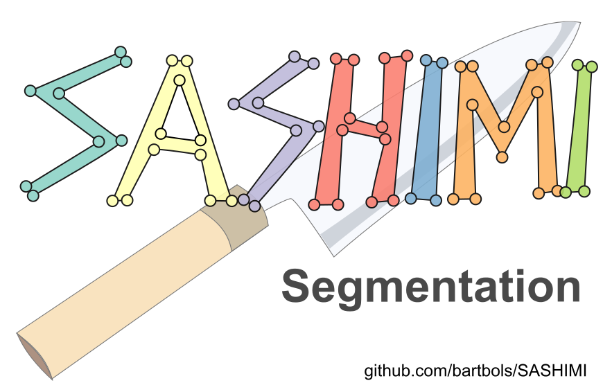

# *SASHIMI*
SASHIMI Segmentation is a MATLAB App for segmentation of multi-slice images.

SASHIMI stands for

  *S*emi-
  *A*utomated
  *S*upervised
  *H*uman-
  *I*nteractive
  *M*ultislice
  *I*mage Segmentation

  SASHIMI was built with the App Designer in Matlab 2019b.
  The following toolboxes are required:
  - Curve Fitting Toolbox
  - Image Processing Toolbox
  
  The standalone version was compiled in Windows using Matlab 2019b.
  The standalone executable does not require Matlab to be installed, but does require Matlab Runtime R2019b 9.7, which can be downloaded for free here:
  https://au.mathworks.com/products/compiler/matlab-runtime.html

  Tutorial videos for SASHIMI Segmentation can be found on YouTube:
  https://www.youtube.com/playlist?list=PLCgxZJMGTw9c7BVhrIMy-jtjIMyiX8leH